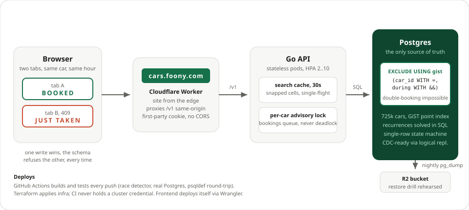

# Carshare

A car-sharing marketplace. Owners list their cars, renters find and book them by the hour. Think Airbnb for cars, built on Go, Postgres, and one exclusion constraint that makes double-booking impossible. The demo seeds 725k cars across the US, Japan, and Europe.

**Live demo: [cars.foony.com](https://cars.foony.com)** — open it in two tabs and race for the same car. One tab books, the other gets JUST TAKEN. That race is the whole design in one interaction.

**Ninety seconds, in reading order:** race the two tabs, then read [the one constraint](db/schema.sql) that makes the loser inevitable (`cars_reservations_no_overlap`), then the war stories in [BENCHMARKS.md](BENCHMARKS.md) — write contention taken from 4 to ~1,200 bookings/s, search from 462ms to 8.7ms by letting the index stream, and then search leaving the database entirely for an in-memory replica.

- **API**: Go stdlib HTTP, Google OAuth sign-in, JSON everywhere
- **Storage**: a single Postgres with the entire booking-correctness story in the schema
- **Measured**: search runs at ~6-13,000 requests/s per pod at any traffic pattern, served from an in-memory replica so Postgres does no search work at all, and bookings at ~4,000/s on one Postgres
- **Deploys**: container image on every push, Terraform for Cloudflare and Kubernetes
- **Operations**: Prometheus metrics, alert rules in the repo, nightly dumps to R2, a restore drill that has actually been run

## How search scales: replicate reads, serialize writes

A rental marketplace is brutally read-heavy. A renter searches dozens of times per booking, bots and map drags add more, and the write rate is bounded by physical reality: a fleet's cars can only be picked up so many times a day. So the two sides get opposite treatments.

**Writes stay on one Postgres and never scale out**, because they do not need to: ~4,000 bookings/s on one box is ~350M bookings a day, and the exclusion constraint that makes double-booking impossible only works when there is exactly one place every reservation must land.

**Reads leave the database entirely.** Every change to a car, reservation, or schedule is captured in the same transaction into an append-only change log (`cars.fleet_log`). Each API pod tails that log into an in-memory copy of the whole fleet ([internal/fleet](internal/fleet), ~500MB for 400k cars, ~3s to load) and answers every search from RAM, exact and ~250ms fresh. The database serves the change stream, whose rate is the booking rate, not the search rate.

That split makes search capacity a horizontal knob: pods share nothing on the read path, so the autoscaler multiplies the ~6-13,000 searches/s each pod measures by however many pods traffic demands, and Postgres never notices. A million users searching cost the database the same as ten.

The change log is deliberately the simple version of this idea: a trigger writes one extra row inside each transaction, and pods poll it. The grown-up version reads the WAL instead, logical replication into a CDC agent (like [Database Sync](https://foony.io/docs/database-sync)) publishing to a broker like NATS that fans out to every pod. That removes the trigger's per-transaction write and the log table entirely, capture becomes free because Postgres already wrote the WAL, and fan-out stops costing one database poller per pod. The search code would not change: the fleet applies self-contained change entries and is indifferent to who delivers them, so a broker subscription slots in where the poller sits.

Stale reads are safe by construction: search only proposes, the constraint disposes. The worst a 250ms-old answer can do is offer a car that was just taken, and booking it returns the same JUST TAKEN conflict the two-tab race demonstrates.

## Quickstart

```bash
./scripts/dev_db.sh            # local Postgres 16 in Docker on :5434
./db/update_schema.sh --apply  # apply db/schema.sql declaratively (psqldef)
make test-sql                  # everything, including the concurrency suite
make run                       # API on :3000, metrics on :9090
```

Sign-in needs Google OAuth credentials (`GOOGLE_CLIENT_ID`, `GOOGLE_CLIENT_SECRET`, `OAUTH_REDIRECT_URL`). Without them the service still runs, just without auth routes. For local testing, mint a session row directly and pass it as a bearer token.

## Architecture



The frontend ([web/](web/)) is Astro + React + Tailwind on a Cloudflare Worker. The Worker serves static assets from the edge and passes `/v1/*` through to the API, so the browser sees a single origin: the session cookie stays first-party and no CORS exists anywhere. Frontend deploys are a `wrangler deploy`, fully decoupled from backend rolls.

The API pods are stateless. All booking correctness lives in Postgres, so pods never coordinate with each other and you can add, kill, or roll them freely. At realistic scale, a million cars and tens of millions of reservations a year, one well-kept Postgres is nowhere near its limits.

Search never queries Postgres: each pod answers from its in-memory fleet, loaded from one snapshot at boot and kept current by tailing the change log ("How search scales" above has the full story, [BENCHMARKS.md](BENCHMARKS.md) the numbers). A car booked in one tab vanishes from the other's next search a quarter-second later.

## API

All routes are JSON under `/v1`. Authentication is a session cookie set by Google sign-in, or the same token as `Authorization: Bearer <token>`.

| Route | What it does |
|---|---|
| `GET /v1/auth/google/login` | starts Google sign-in |
| `GET /v1/auth/google/callback` | finishes it, sets the session cookie |
| `POST /v1/auth/logout` | ends the session |
| `GET /v1/me` | who am I |
| `POST /v1/cars` | list a car (`lat`, `lng`, `price_per_hour` in cents) |
| `PATCH /v1/cars/{id}` | owner edits price, location, or `is_listed` |
| `GET /v1/cars/{id}` | car details, used to quote a price before booking |
| `GET /v1/cars/{id}/calendar?from&to` | owner's view: bookings plus recurring holds |
| `GET /v1/availability?lat&lng&from&duration_minutes&range_meters&sort&page` | cars free for the whole window, closest first by default, `sort=price` for cheapest trip first. 100 per page, 1,000 results max, answered from the in-memory fleet |
| `POST /v1/reservations` | book: `car_id`, `price` (the trip price you saw), `from`, `duration_minutes`, `kind` (`rental`, `rental_hold`, `owner`), optional `idempotency_key` |
| `POST /v1/reservations/{id}/confirm` | turn a hold into a rental |
| `DELETE /v1/reservations/{id}` | cancel: free up to 24h before start, or within 1h of booking (holds cancel any time) |
| `GET /v1/me/reservations` | my bookings |
| `POST /v1/schedules` | owner's repeating hold: `car_id`, `from`, `duration_minutes`, `period` (`weekly`, `monthly`, `yearly`), `timezone` |
| `DELETE /v1/schedules/{id}` | cancel a repeating hold |

Errors come back as `{"error":{"code","message"}}` with stable codes (`conflict`, `price_changed`, `owner_schedule_conflict`, `too_late_to_cancel`, ...).

## Data model, and why it looks like this

Six tables in a `cars` Postgres schema (see [db/schema.sql](db/schema.sql)): `users`, `identities`, `sessions`, `cars`, `reservations`, `recurrences`.

**Logins are a separate `identities` table**, keyed `(provider, subject)`, not a `google_sub` column on users. The key is the provider's stable subject id, never the email, because emails change. Adding a second login provider is a new row, not a users migration.

**One exclusion constraint is the whole double-booking story.**

```sql
CONSTRAINT cars_reservations_no_overlap
  EXCLUDE USING gist ("car_id" WITH =, "during" WITH &&) WHERE ("status" = 'confirmed')
```

Two confirmed reservations for the same car can never overlap in time. Not "the app checks first", the database physically refuses the second row, under any concurrency, at any isolation level. Ranges are half-open `[start, end)`, so back-to-back bookings like 1-2pm and 2-3pm never touch.

**Locations are the built-in `point` type with a GiST index**, not PostGIS. PostGIS is the right answer for real geography, but for "cars near a point, closest first" the built-in type already gives an indexed radius filter (`location <@ circle(...)`) and exact-enough distances (longitude scaled by cos(latitude), well under 1% error at search-circle sizes). One less extension to operate.

**Prices are integers, in cents.** The trip price is frozen onto the reservation at booking time, so an owner's later price change never rewrites history.

## The races, one by one

Every mutation is either one conditional SQL statement or a short transaction ending in an insert the exclusion constraint can reject. There is no check-then-act gap anywhere, which is the entire trick.

**Two renters, same car, same window.** Both insert. The constraint serializes them, one commits, the other gets error `23P01` and the API returns `409 conflict`. Proven by a test that races 8 goroutines and requires exactly 1 winner.

**Booking retries.** Send an `idempotency_key`. A retry of a request that already succeeded returns the original reservation instead of a second one, enforced by a partial unique index, checked before insert because a retry overlaps its own row.

**Holds.** A `rental_hold` blocks the car like a booking, but carries `hold_expires_at`. When it expires it stops counting: availability ignores it, and the next booking attempt deletes it inside its own transaction before inserting. Two concurrent stealers serialize on that delete, exactly one wins. Confirming a hold is a single conditional `UPDATE` that requires the hold to still be alive and yours.

**Price changes.** The booking insert re-checks the car's current price against the price the renter agreed to, in the same statement that books. Stale quote, no booking, `409 price_changed`.

**Owner schedules vs renter bookings.** The rule: reservations always beat recurrences. A booking checks the recurrences visible at its snapshot. If the owner schedules concurrently, the booking stands and the owner misses that occurrence, which is exactly the product behavior we want, so `scheduleCar` needs no conflict check at all and the race disappears by design.

**Cancellation.** One conditional `UPDATE`: yours, still confirmed, and either a hold, more than 24 hours before start, or within one hour of booking. Cancelled rows drop out of the exclusion constraint so the slot frees instantly.

## Recurring owner holds

Owners can block their car on a schedule, an evening ("every Wednesday 1-3pm") or a span ("the first weekend of every month"), with `weekly`, `monthly`, or `yearly` periods. Recurrences are **evaluated at query time** by one SQL function, `cars.recurrence_overlaps`, never expanded into rows. The function is closed-form: it computes which occurrence lands near the queried window and checks that one and its neighbors, so cost is constant per recurrence no matter how old the schedule is.

Occurrence times are computed in the schedule's IANA timezone, so a 1pm hold stays at 1pm wall-clock across DST transitions. Month arithmetic clamps like Postgres does: a Jan 31 monthly hold lands on Feb 28. Both behaviors are pinned by tests.

## Monitoring

Everything is Prometheus, prefix `carshare_`:

- `carshare_requests_total{route,status}` and `carshare_request_duration_seconds{route}`: the RED basics per route
- `carshare_bookings_total{kind,outcome}`: business health. A spike in `conflict` is contention, a spike in `price_changed` is repricing churn, a drop in `confirmed` is revenue
- `carshare_holds_expired_total`: how often people abandon checkout
- `carshare_db_pool_*`: pool saturation before it becomes latency
- `carshare_search_cache_total{result}`: whether the cache earns its keep, hit rate should climb with traffic
- `carshare_errors_total{component,kind}`: internal failures, labeled by the broken part
- `carshare_double_booked_pairs`: **the invariant gauge**. A background loop counts overlapping confirmed pairs among current and future reservations. The constraint guarantees correctness; the gauge catches what the constraint cannot survive, a migration dropping it or a bad restore. Its alert is critical with `for: 0m`

Alert rules ship in [terraform/monitoring.tf](terraform/monitoring.tf): down, error rate at two severities, p95 latency, pool saturation, HPA pinned at max, stale backup, and the double-booking invariant. Two things to check before trusting any of it: Alertmanager needs real receivers, and the external Cloudflare health check in [terraform/cloudflare.tf](terraform/cloudflare.tf) covers what in-cluster metrics cannot see: DNS, TLS, and the path into the cluster.

## Meeting an SLA

Target: **99.9% monthly availability** and **p95 under 300ms** on search and booking.

- **Measure twice.** White-box (the request metrics above) and black-box (the Cloudflare health check hitting `/health` from three regions). You page on either. In-cluster metrics miss dead DNS, the health check misses a broken booking path, together they cover each other.
- **Error budget.** 99.9% is ~43 minutes per month. The two error-rate alerts approximate fast and slow burn: the critical one catches "we are torching the budget right now", the warning one catches "we will run out this week".
- **Deploys can't break it.** CI runs the race-detector concurrency suite against a real Postgres with the schema applied by psqldef, so both the code and the schema that ships are the tested ones. Rollouts go through readiness probes with a PDB (`min_available: 1`) and an HPA floor of 2, so a bad image never drains the fleet. Images are tagged immutably, rollback is `terraform apply -var image_tag=<previous>`.
- **Schema changes ship additive-first.** Apply the schema before deploying code that needs it, never the reverse. `db/update_schema.sh` is a dry run by default so you read the DDL diff before touching production, and CI proves `schema.sql` round-trips to a no-op.
- **Data loss is bounded.** Nightly `pg_dump` to R2 puts the RPO at 24 hours worst case. If that is too much, the upgrade is continuous WAL archiving to the same bucket for point-in-time recovery. The RTO is whatever the restore drill below takes, so run the drill before you need it.

### Restore drill

```bash
aws s3 cp "s3://$BUCKET/carshare/$(date -u +%Y-%m-%d).dump" ./restore.dump --endpoint-url "$R2_ENDPOINT"
createdb carshare_restore
pg_restore -d carshare_restore --no-owner ./restore.dump
psql -d carshare_restore -c 'SELECT count(*) FROM cars.reservations'  # sanity: numbers you expect
```

Then point `DATABASE_URL` at the restored database and roll the pods. Practice quarterly, time it, and that number is your honest RTO.

## Deploying

1. CI builds `ghcr.io/<owner>/carshare:latest` plus an immutable `YYYY.MM.DD_HH.MM.SS-sha` tag on every master push.
2. `terraform apply` in [terraform/](terraform/) with your variables: Cloudflare DNS and health check for `cars.foony.com`, namespace, secrets, deployment, service, ingress, HPA, PDB, alert rules, and the backup CronJob. Secrets are variables with no defaults, nothing sensitive lives in the repo.
3. Schema changes: edit `db/schema.sql` to the desired end state, `./db/update_schema.sh` to read the diff, `--apply` to apply, then roll the pods (drivers cache prepared statements per connection).

**Why not GitOps here.** With many services, the image tag would move into a git repo and Argo CD would reconcile it. For one service that machinery costs more than it saves, and the manual `terraform apply` buys something concrete for an open-source repo: **CI never holds a cluster credential**. GitHub Actions can build and publish images but cannot touch Kubernetes, which is the same property Argo's pull model provides, achieved here by not automating the last step.

## Benchmarks

Measured, not estimated: [BENCHMARKS.md](BENCHMARKS.md) runs the store at 1k, 100k, and 1M cars. Booking throughput is flat (~4-5,000/s on one Postgres, p50 ~7ms) no matter the fleet size, because the write path is per-car index work. A single contended car serializes at ~1,200 bookings/s on its advisory lock. Search started at 52/s against Postgres and ends served from an in-memory replica fed by a transactional change log: ~6-13,000 requests/s per pod whatever the traffic pattern, worst case included, with the database doing zero search work. The three war stories in there, the write-contention deadlocks, the query-planner fight, and the read model that ended it, are the best part of this repo.

## Change data capture

Every state transition here is a single-row write: booking is one `INSERT`, confirming a hold is one one-column `UPDATE`, cancelling is one one-column `UPDATE`. There is no saga and no outbox table, because there is nothing to keep consistent across tables, the row *is* the state machine. That makes `cars.reservations` an unusually clean logical-replication source: set `wal_level = logical`, point any CDC pipeline at Postgres, and you get a correct, ordered booking event stream for analytics, notifications, or search indexing with zero application changes. Two notes for whoever wires it: consumers that want old values on updates need one line, `ALTER TABLE cars.reservations REPLICA IDENTITY FULL`, and the seeded-hold delete inside `OrderCar` means expired holds emit deletes, which downstream should treat as releases, not cancellations.

## What changes at real scale

Say the fleet grows to 100M cars and search traffic to 30k requests a second. What breaks, and what already holds:

- **Reads first.** Already built: the [30-second snapped cache](internal/httpapi/searchcache.go) means search load is bounded by distinct busy cells per 30 seconds, not by users. 30k searches a second concentrated on a hundred hot neighborhoods is a few hundred database queries a minute.
- **Shard by geography, not by a city id.** There is deliberately no city column anywhere, cars are bare coordinates and searches are lat/lng circles, so the shard key at extreme scale is the map itself: coarse regions sized so a max-radius circle almost always falls inside one shard. A circle that straddles a boundary fans out to the neighbor and merges two pages, a car whose owner moves it across a boundary is one row migration, and bookings shard perfectly because a reservation lives wherever its car does. Each shard is this exact system, small.
- **The constraint scales with you.** The exclusion check is an index lookup on (car, time), it does not care how many other cars exist. Booking write volume per car is human-scale by definition.
- **Global serving** is those geographic shards pinned to regional databases with anycast routing to the nearest region, not one worldwide database.

## Repo layout

```
cmd/carshare/          entrypoint: config, pools, two listeners, shutdown
cmd/bench/             the fleet-size benchmark ladder behind BENCHMARKS.md
cmd/seed/              the worldwide seeder: cities + a land/water mask
internal/httpapi/      routes, validation, the search cache, error mapping
internal/store/        every SQL statement, the DataStore interface
internal/store/memstore/  in-memory DataStore for handler tests
internal/auth/         session tokens (hashed at rest) and Google OAuth
internal/{config,logging,metrics}/  the boring glue
db/                    schema.sql (declarative, psqldef) + apply script
web/                   the site: Astro + React on a Cloudflare Worker
terraform/             Cloudflare + Kubernetes + alerts + backups
docs/                  the architecture diagram
scripts/dev_db.sh      local Postgres for development and tests
```

## License

MIT
